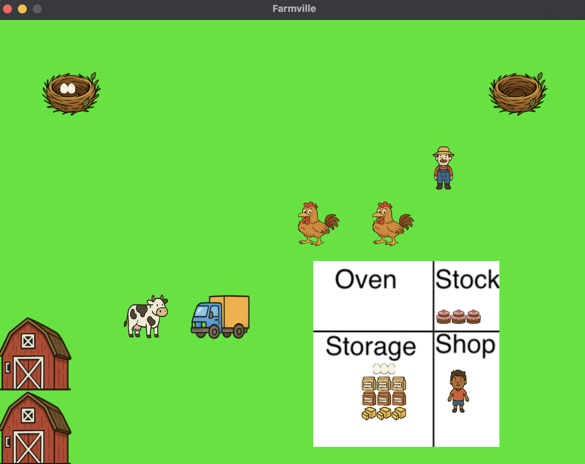

## Goal: 
Gain hands-on experience with C++ threads in a simple graphics environment.

## Task: 
Our homework is inspired by the former Facebook game called Farmville. If you were a developer working on that project, you might create a thread to animate a chicken: it would peck around in the yard, maybe find a nest and lay an egg in it, etc. Each action updates the position of the chicken image in the game state (a graph of objects), and then the game redraws the whole game state at some frequency, perhaps 30 frames per second or 60 frames per second.

## Given code: 
We are providing a framework that utilizes the CUGL graphics package from CS 5152. In `FarmLogic.cpp`, we include a program intended to illustrate how you’ll use it – but the scene it shows makes no real sense! It really just illustrates the kinds of predrawn objects available to you, and sort of scatters them around, and animates a few of them in minor ways. For example, this is a screenshot we made of it:

## Code overview: 
- This project is using [CUGL](https://www.cs.cornell.edu/courses/cs5152/2025sp/resources/engine/) from CS 5152. Most of the graphics have been abstracted away, so students who wish only to complete the threading exercise do not need to worry about it. However, there will be an extra credit incentive for those who wish to make their farm simulation look nice (detailed below). 
- Your main logic should go in `FarmLogic::run()`. It should be possible to complete this assignment by only touching `FarmLogic`
- Those who wish to add more advanced functionality or graphics may edit the rest of the code. Sections that should not be touched will be clearly marked
- `DisplayObject::redisplay()` sends a snapshot of the simulation state to the graphics framework to be drawn. Try to call this method at least 10 times per second (10 frames per second)
- All on-screen objects are represented as rectangles with a width and a height
- The positions of objects are center anchored. For example, an chicken at (x,y) = (100,100) and (width,height) = (40,40) would have verticies at (80,80),(120,80),(120,120),(80,120)
- The Farm is 800 pixels wide and 600 pixels tall. The bottom left is (0,0), and the top right is (800,600)
- Each object has an ID field. This value should be unique for all objects
- Each object has a layer field. Objects with a higher layer value will be rendered above objects with lower layer values. We recommend layer=0 for stationary objects (e.g. nests, barns, bakery), layer=1 for items (e.g. eggs, flour, butter), and layer=2 for moving objects (e.g. chicken, cow, farmer)
- Objects in the same layer should not collide. We will be testing for this
- Each object has the `setTexture` and `setPos` methods to change its texture or position.
- Each object has an `updateFarm` and `erase` method. `updateFarm` updates (and if needed, inserts) its value in the shared farm state object, and `erase` removes the object from the shared farm state object. When these are called, it will be reflected on screen upon the following `redisplay()` call

## How to run:
- Python dependencies: PyYAML, Pillow, shortuuid
- `./compile.sh` to compile
- `./run.sh` to run
- After your first build, you can use `./compile.sh skip-cugl` to speed up compilation
- If this is not working on your machine, we have steps below detailing how to run this in a VirtualBox Ubuntu VM

## The scenario:
- We have a set of barns that produce eggs, flour, butter and sugar. The screen definitely has room for two barns, so we will have one that produces butter and eggs, and a second farm that produces flour and sugar. On a farm there will be a few “prebuilt” nests, initially empty. You definitely will want at least two nests but more may be useful.
- The farm can produce “unlimited” amounts of butter, and the flour/sugar farm can make unlimited flour and sugar, but eggs need to match what the chickens lay.
- You should have a non-trivial amount of animals visible: at least three chickens and two cows. Chickens basically walk from nest to nest, wait for space, and then lay one or more eggs in the nest. A nest with 3 eggs is full. You will want a pretty rapid supply of eggs. Even so, the chickens should sometimes move around – they can’t just sit on a nest laying eggs continuously. At a minimum, your chickens must change to a different nest at least once every 3 eggs laid, and they do this by walking, not teleportation.
- From time to time the farmer comes and collects the eggs. This empties the nests.
- You can animate the cows, or just have them standing around. The farmer can milk the cow now and then, but you would need to add animations in CUGL for that. We are not requiring that you show the farmer milking the cow, but the best looking simulated farms will receive extra credit (detailed below)
- There should be two trucks. One of them drives back and forth to the butter and egg barn, and the other drives to the flour and sugar barn. On arrival, each loads up with a full load of produce, then takes it to the bakery for storage. The truck unloads into the bakery, and then can go fetch more produce. A truck never needs to “wait” for butter, flour or sugar, but may need to wait for eggs, if it arrives when the farm doesn’t any available
- A full load of produce “fills a truck”. This will be three of each: three eggs, three boxes of butter, three bags of flour, three bags of sugar. Notice that the eggs are still a limiting factor because in our setup since we can see them being laid. If the farm has extra crates of eggs, the truck can’t take them all in one load: it would carry three, then come back for three more, etc.
- Again, keep in mind that moving is a step by step process. A truck doesn’t teleport from the factory to the farm: it has to follow some form of path (road) from factory to farm and back. If you like, you can add a background image for the roads you will use
- Now, let’s focus on the bakery. The bakery's storage has a capacity of 6 of each item, and when it is full for any given item, the truck must wait for space to unload
- There is an oven, which requires two of each item to run. You can bake a batch of cakes only if the oven is free (no prior batch is baking) and if there is room for the batch in the "stock" of the pastry shop. This stock area has room for 6 cakes, and each baked batch is 3 cakes.
- Children come to buy the cakes. They can buy as few as one cake or as many as six, randomly. Only one child can enter the pastry shop at a time. There should be five children, and all of them stand around waiting to buy a cake, then walk away (to take to be eaten), and then return for another cake. We should be able to see all five children at all times. A child will wait (in the shop) if he or she is trying to buy k cakes, but there are currently less than k in stock. When more are baked, that child continues to buy them until it reaches the target number. So for example, a child who wants 5 cakes and enters when there is just 1 left would need to wait for two more batches (3 cakes each!) to be ready. Then there would be 2 remaining when that child leaves the store (1 + 6 – 5). As the number of cakes changes, make sure the stock shows an accurate number of cakes.
- In addition to displaying the farm, we also track how many eggs have been laid and how many have been used up, how much butter, etc. The statistics are shown in the console. The system just runs endlessly, but shouldn’t ever “lose” products!

Notice the various synchronization conditions!
- We aren’t allowing children or chickens or trucks or other objects at the same layer to occupy the same space at the same time. You’ll need to enforce this. If your trucks follow roads that cross, they will need to be careful at the intersections or a crash could occur!
- A nest isn’t allowed to overflow: once it has 3 eggs in it, that nest is full until the farmer empties it. If a nest ever has 4 eggs, that would be a synchronization error.
- A truck must be emptied before it can do its next trip to the farm, but emptying it requires space in the bakery's storage for all the products it carried. It must also be full when it leaves the farm.
- The oven can't bake until it can take the required ingredients from storage and until there is space in the store's stock
- There may be additional requirements that we haven’t mentioned, for example to avoid having chickens or trucks crash into each other. (And you are welcome to extend the basic setup, but if you do, it would probably add more synchronization requirements).
- There are also C++ language synchronization requirements. Look for variables that need to be updated or read in critical sections and be sure to protect them properly!

## Your job:
- Our existing program has a displayable object class and creates some basic objects, which it displays in a pretty random way so that you can see them. Then it loops animating one or two things, again in a totally random way to demonstrate the capability. 
- Your task is create one thread per moving object, which would loop and show the object as it moves around. Use the monitor style of synchronization, and use monitor condition variables to wait for specific things.
- Additionally, do the redisplay action in a separate thread that loops: it should redisplay, sleep for a while, then repeat. Aim for at least 10 frames per second (100ms sleep time)
- PLEASE NOTE: Our main program (as given to you) uses usleep. This is NOT the way for threads to pause – it pauses the whole application. Your threads will be using the condition variable wait_until operation, which lets you wait for a timed delay. You should read about wait_until, and eliminate usleep completely from your new main process. 

## Part 1: Due on X 
For this part of the assignment, we want you to implement all the needed threads to do concurrent animation of all the moving parts, with proper layout on the screen (you have to decide where to put each thing), but without implementing any of the logic for threads interacting with each other. For example, you won’t worry about chickens walking right over each other, or trucks colliding. You won’t worry that the oven needs to coordinate with the stock or even that it needs two units of each ingredient to make a batch of cakes – just have it work randomly, like in our given code. Basically, any rule in the application that involves two threads talking to one another is in part 2, and if you are unsure, just ask on Ed.

Have `redisplay` called from a separate thread that loops, redisplays, sleeps for a while, then repeats.
Even so, there is one form of synchronization required! Our `updateFarm` and `erase` methods are not thread safe, and because
the underlying display image shows every object, needs to be protected so that (a) two threads never call
`updateFarm` on the identical object, and (b) if `redisplay()` is running, nobody can call `updateFarm`, and vice-versa. Part 1
will be buggy if you do not implement this one form of mutual exclusion.

The simulation should run until ^C or until the window is closed

For part 1 we will look at your logic for ensuring that your `redisplay()`, `updateFarm()`, and `erase()` do not both enter the critical section concurrently, do not deadlock, and do not livelock. This is the only thing we will evaluate on part 1.

## Part 2: Due on X
For this part, add to your part 1 all the missing logic for all the synchronization required to fully implement the application.

What we will evaluate:
- For both parts, we will run your program and make sure that the animation seems to be correct and implementing our various rules (e.g. no objects on the same layer collide, there must be at least 2 of each item for the oven to bake a batch, etc). 
- We will check that you aren’t losing produce (like eggs that vanish).
- We will also check to see that your code has no deadlocks or livelocks caused by the extra synchronization required to implement part 2.

Additional requirements for part 2:
1. At least one situation where chickens must check for and coordinate with other chickens to avoid "crashing into one-another"
2. At least one situations where two or more chickens contend for the same nest
3. At least one nest where the eggs would not come all from one chicken (e.g. not "one chicken lays all 3 eggs" but "1 egg was from chicken A, the other 2 from chicken B").
4. You must protect against excess eggs per nest. A chicken can't lay a 4th egg in a nest.
5. The farmer cannot collect eggs from a nest while a chicken is sitting on it.
6. A truck cannot collect eggs that have not actually been produced yet
7. The trucks must have some potential for reaching some form of intersection at the same time, and must coordinate so that first one goes through, then the other, and it can't always be that truck B always waits until after truck A passes. The rule has to depend on who gets there in what order and when, not some kind of rigid thing that might leave truck B waiting ten minutes until truck A happens to pass, for example.
8. A child who has his or her turn to buy cakes gets to wait until he or she has the proper number of
cakes
9. Children can't walk over one-another.

## Virtualbox steps:
- todo: detail vbox run steps

## Extra credit:
- todo: detail extra credit competition